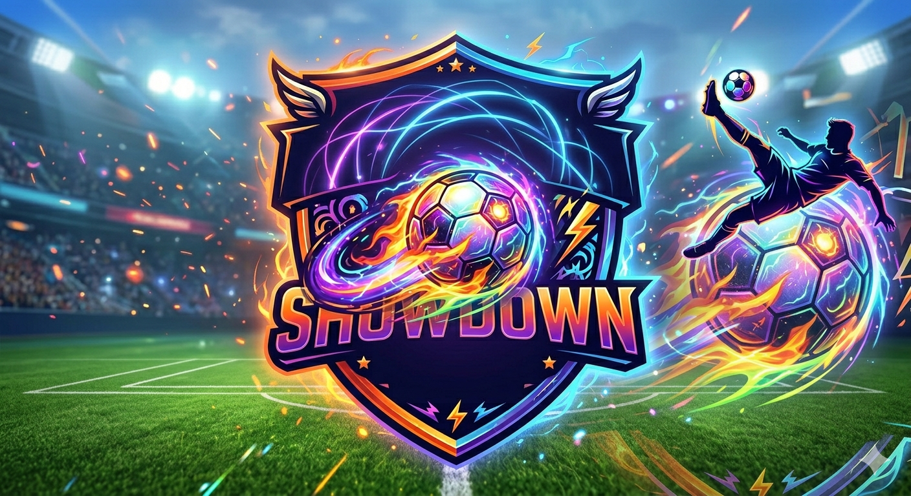

# REDLOCK

### Survival Football Academy

**Awaken Your Ego. Dominate the Field.**

[Play Now](https://football.b4f.site)

## About REDLOCK

REDLOCK is an online football management game set in a high-stakes survival academy. Start with your own club, recruit the right players, build a powerful squad, and create the tactics needed to overcome every challenge on the pitch.

Every match comes alive in real time through live events, scores, statistics, and decisive moments. Your choices—from player selection and positioning to your overall style of play—shape the final result.

## Your Journey

1. **Create Your Club** — Choose your starting team and enter the REDLOCK academy.
2. **Build Your Squad** — Place each player in the position that best supports your game plan.
3. **Develop Your Players** — Earn experience, level up, and improve individual attributes.
4. **Master Your Tactics** — Control your formation, passing approach, shooting intent, and pressing intensity.
5. **Conquer the Campaign** — Defeat increasingly powerful opponents, earn rewards, and unlock new challenges.
6. **Experience Every Match** — Follow live events, key moments, and the outcome of your tactical decisions.

## Highlights

### Club Management

Manage your squad, budget, ranking, and club progression from one central hub.

### Player Collection

Collect player cards, discover their unique attributes, and develop them to suit your vision for the team.

### Your Tactics, Your Identity

Choose a formation, arrange your lineup, and define how your team plays. There is no single winning formula—the strongest squad is the one that best reflects its manager's strategy.

### A 50-Stage Campaign

Face different clubs across 50 challenges. Win matches to earn rewards, strengthen your squad, and unlock the next stage of your journey.

### Player Gacha

Try your luck on featured banners, expand your collection, and discover the special player your squad has been waiting for.

### Live Match Experience

Follow the score, match statistics, goalscorers, and a real-time stream of events as the action unfolds.

## Game Modes

| Mode | Experience | Status |
| --- | --- | --- |
| Campaign | Defeat clubs, clear stages, and earn rewards | Available |
| Squad Management | Arrange players and customize your tactics | Available |
| Gacha | Recruit players and expand your collection | Available |
| PvP | Compete directly against other managers | In development |
| Shop | Discover additional content and items | In development |

## Visual Style

REDLOCK combines the atmosphere of a packed football stadium with vivid blue, purple, and orange neon lights. Dark interface panels, energetic effects, and high-contrast imagery create the feeling of a futuristic football academy where ambition, strategy, and ego collide.

## Enter the Arena

Are you ready to build a squad of your own?

**Play at [football.b4f.site](https://football.b4f.site)**

> Awaken Your Ego. Dominate the Field.
